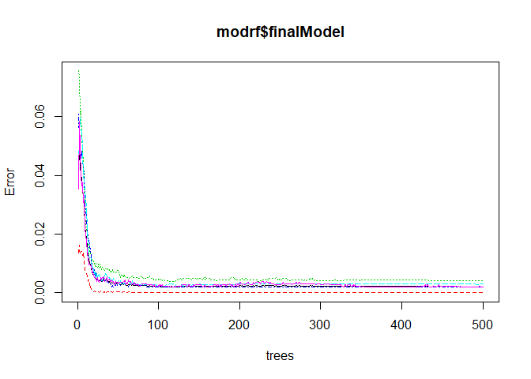
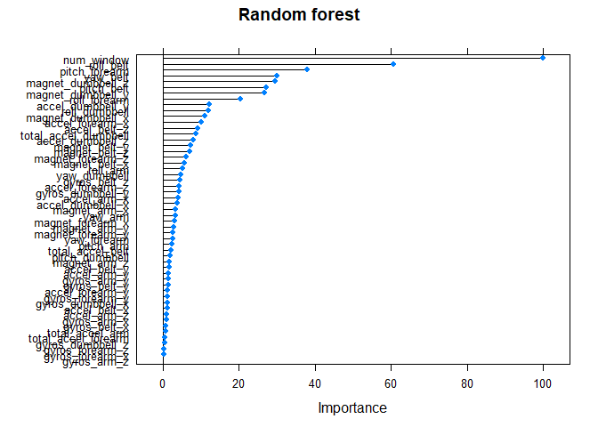
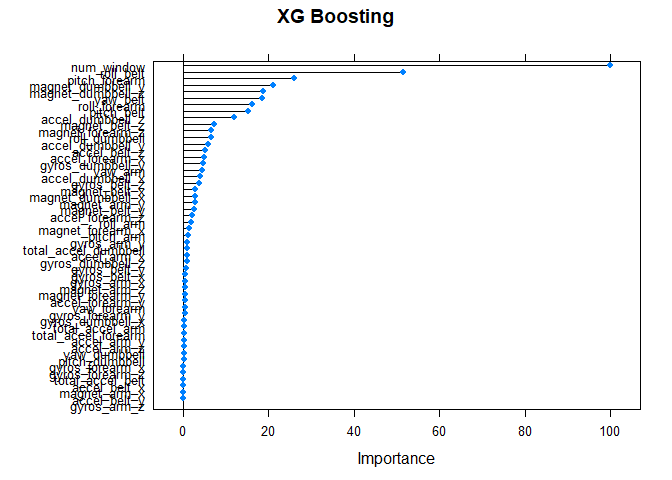

#Loading the Packages

```r
library(caret)
library(doParallel)
library(ggplot2)
library(randomForest)
library(xgboost)
```
Loading the required packages. For this project, we need caret package to perform model training and prediction. ggplot2 to visualize the data. I've chosen two algorithms, randomForest and xgboost to run on this dataset. We'll use parallel processing to speed up the process. For this, we use doParallel package.

#Loading the train data

```r
#Loading the train data
pml_train=read.csv(file.choose(), header=T, sep=",", na.strings=c(""," ",NA))
```
Loading the train dataset into the variable 'pml_train' from my local machine using the functions read.csv and file.choose. The data has some columns with many NA's, some with empty spaces and some with " " characters. This can be dealt with na.strings option inside the read.csv function.

#Preprocessing

```r
#Sorting the columns based on number of NA's
sapply(pml_train, function(x){sum(is.na(x))})[colSums(is.na(pml_train)) != 0]
```

```
##       kurtosis_roll_belt      kurtosis_picth_belt        kurtosis_yaw_belt 
##                    19216                    19216                    19216 
##       skewness_roll_belt     skewness_roll_belt.1        skewness_yaw_belt 
##                    19216                    19216                    19216 
##            max_roll_belt           max_picth_belt             max_yaw_belt 
##                    19216                    19216                    19216 
##            min_roll_belt           min_pitch_belt             min_yaw_belt 
##                    19216                    19216                    19216 
##      amplitude_roll_belt     amplitude_pitch_belt       amplitude_yaw_belt 
##                    19216                    19216                    19216 
##     var_total_accel_belt            avg_roll_belt         stddev_roll_belt 
##                    19216                    19216                    19216 
##            var_roll_belt           avg_pitch_belt        stddev_pitch_belt 
##                    19216                    19216                    19216 
##           var_pitch_belt             avg_yaw_belt          stddev_yaw_belt 
##                    19216                    19216                    19216 
##             var_yaw_belt            var_accel_arm             avg_roll_arm 
##                    19216                    19216                    19216 
##          stddev_roll_arm             var_roll_arm            avg_pitch_arm 
##                    19216                    19216                    19216 
##         stddev_pitch_arm            var_pitch_arm              avg_yaw_arm 
##                    19216                    19216                    19216 
##           stddev_yaw_arm              var_yaw_arm        kurtosis_roll_arm 
##                    19216                    19216                    19216 
##       kurtosis_picth_arm         kurtosis_yaw_arm        skewness_roll_arm 
##                    19216                    19216                    19216 
##       skewness_pitch_arm         skewness_yaw_arm             max_roll_arm 
##                    19216                    19216                    19216 
##            max_picth_arm              max_yaw_arm             min_roll_arm 
##                    19216                    19216                    19216 
##            min_pitch_arm              min_yaw_arm       amplitude_roll_arm 
##                    19216                    19216                    19216 
##      amplitude_pitch_arm        amplitude_yaw_arm   kurtosis_roll_dumbbell 
##                    19216                    19216                    19216 
##  kurtosis_picth_dumbbell    kurtosis_yaw_dumbbell   skewness_roll_dumbbell 
##                    19216                    19216                    19216 
##  skewness_pitch_dumbbell    skewness_yaw_dumbbell        max_roll_dumbbell 
##                    19216                    19216                    19216 
##       max_picth_dumbbell         max_yaw_dumbbell        min_roll_dumbbell 
##                    19216                    19216                    19216 
##       min_pitch_dumbbell         min_yaw_dumbbell  amplitude_roll_dumbbell 
##                    19216                    19216                    19216 
## amplitude_pitch_dumbbell   amplitude_yaw_dumbbell       var_accel_dumbbell 
##                    19216                    19216                    19216 
##        avg_roll_dumbbell     stddev_roll_dumbbell        var_roll_dumbbell 
##                    19216                    19216                    19216 
##       avg_pitch_dumbbell    stddev_pitch_dumbbell       var_pitch_dumbbell 
##                    19216                    19216                    19216 
##         avg_yaw_dumbbell      stddev_yaw_dumbbell         var_yaw_dumbbell 
##                    19216                    19216                    19216 
##    kurtosis_roll_forearm   kurtosis_picth_forearm     kurtosis_yaw_forearm 
##                    19216                    19216                    19216 
##    skewness_roll_forearm   skewness_pitch_forearm     skewness_yaw_forearm 
##                    19216                    19216                    19216 
##         max_roll_forearm        max_picth_forearm          max_yaw_forearm 
##                    19216                    19216                    19216 
##         min_roll_forearm        min_pitch_forearm          min_yaw_forearm 
##                    19216                    19216                    19216 
##   amplitude_roll_forearm  amplitude_pitch_forearm    amplitude_yaw_forearm 
##                    19216                    19216                    19216 
##        var_accel_forearm         avg_roll_forearm      stddev_roll_forearm 
##                    19216                    19216                    19216 
##         var_roll_forearm        avg_pitch_forearm     stddev_pitch_forearm 
##                    19216                    19216                    19216 
##        var_pitch_forearm          avg_yaw_forearm       stddev_yaw_forearm 
##                    19216                    19216                    19216 
##          var_yaw_forearm 
##                    19216
```

```r
#Removing the columns with more than 10000 NA's
preproc_train<-pml_train[ ,colSums(is.na(pml_train))<=500]
#Removing the first 6 columns as they're of no use
preproc_train<-preproc_train[,-(1:6)]
```
Using the sapply function to see the columns with number of NA's in this dataset. After that I've removed the columns with more than 50% of data with NA's. Actually there are many NA's. There are 100 columns with NA's. Later removing the 1st 6 columns in database which include name, raw timestamp etc So we're left with 54 columns with classe (dependant variable) included.


```r
#creating partitions in train data
inTrain<-createDataPartition(y=preproc_train$classe, p=0.7, list=FALSE)
training<-preproc_train[inTrain, ]
testing<-preproc_train[-inTrain, ]
```
Splitting the train data into training and testing in 70:30 ratio.

#Model Training

```r
#setting a seed
set.seed(11207)
#creating a random forest model with cv
cl<-makeCluster(detectCores())
registerDoParallel(cl)
modrf<-train(classe~., data=training, method="rf", preProcess = c("center", "scale"), trControl=trainControl(method="repeatedcv", number=5, repeats=5))
saveRDS(modrf, file = "RF.rds")
#creating a xgb linear model
modxgb<-train(classe~., data=training, method="xgbLinear", preProcess = c("center", "scale"), trControl=trainControl(method="cv", number=5))
saveRDS(modxgb, file = "XGB.rds")
stopCluster(cl)
#modrf<-readRDS("RF.rds")
#modxgb<-readRDS("XGB.rds")
```
Setting a seed and training random forest and XG Boost models with the training data. Saving the models using saveRDS function as knitting the .Rmd file takes forever. Using readRDS to load the models and predict the output.

#Predicting on Train data

```r
#predicting training split data with rf model
predrf<-predict(modrf, testing)
confusionMatrix(predrf, testing$classe)$overall[1]
```

```
##  Accuracy 
## 0.9989805
```

```r
#predicting training split data with xgb tree model
predxgb<-predict(modxgb, testing)
confusionMatrix(predxgb, testing$classe)$overall[1]
```

```
##  Accuracy 
## 0.9996602
```

```r
#results
table(predrf, predxgb)
```

```
##       predxgb
## predrf    A    B    C    D    E
##      A 1672    1    0    0    0
##      B    1 1137    0    0    0
##      C    0    0 1026    2    0
##      D    0    1    0  962    0
##      E    1    2    0    0 1080
```
Predictions are made for both random forest and XG Boost models. The Accuracy of the models on training set is also checked. We can see that the accuracy is almost same for both the models but random forest model outperforms the XG Boosting model. From the table comparing the predictions of both the models, we can infer that they've almost same predictions except for 1-2 differences for classes C, D and E.

#Variable Importance

```r
plot(modrf$finalModel)
```

<!-- -->

```r
plot(varImp(modrf), main="Random forest")
```

<!-- -->

```r
plot(varImp(modxgb), main="XG Boosting")
```

<!-- -->
The final model of the Random forest can be seen here. We see that the error approaches to 0 with the number of trees equal to 15-20 approximately. Rest, it stays close zero. From both the variable importance plots, we can say that the predictors num_window, roll_belt, pitch_forearm are the top 3 predictors in both the models. The remaining predictors slightly differ in their importance levels to the model.

#Using the test data

```r
#Loading the train data
pml_test=read.csv(file.choose(), header=T, sep=",", na.strings=c(""," ",NA))
#Sorting the columns based on number of NA's
sapply(pml_test, function(x){sum(is.na(x))})[colSums(is.na(pml_test)) != 0]
```

```
##       kurtosis_roll_belt      kurtosis_picth_belt        kurtosis_yaw_belt 
##                       20                       20                       20 
##       skewness_roll_belt     skewness_roll_belt.1        skewness_yaw_belt 
##                       20                       20                       20 
##            max_roll_belt           max_picth_belt             max_yaw_belt 
##                       20                       20                       20 
##            min_roll_belt           min_pitch_belt             min_yaw_belt 
##                       20                       20                       20 
##      amplitude_roll_belt     amplitude_pitch_belt       amplitude_yaw_belt 
##                       20                       20                       20 
##     var_total_accel_belt            avg_roll_belt         stddev_roll_belt 
##                       20                       20                       20 
##            var_roll_belt           avg_pitch_belt        stddev_pitch_belt 
##                       20                       20                       20 
##           var_pitch_belt             avg_yaw_belt          stddev_yaw_belt 
##                       20                       20                       20 
##             var_yaw_belt            var_accel_arm             avg_roll_arm 
##                       20                       20                       20 
##          stddev_roll_arm             var_roll_arm            avg_pitch_arm 
##                       20                       20                       20 
##         stddev_pitch_arm            var_pitch_arm              avg_yaw_arm 
##                       20                       20                       20 
##           stddev_yaw_arm              var_yaw_arm        kurtosis_roll_arm 
##                       20                       20                       20 
##       kurtosis_picth_arm         kurtosis_yaw_arm        skewness_roll_arm 
##                       20                       20                       20 
##       skewness_pitch_arm         skewness_yaw_arm             max_roll_arm 
##                       20                       20                       20 
##            max_picth_arm              max_yaw_arm             min_roll_arm 
##                       20                       20                       20 
##            min_pitch_arm              min_yaw_arm       amplitude_roll_arm 
##                       20                       20                       20 
##      amplitude_pitch_arm        amplitude_yaw_arm   kurtosis_roll_dumbbell 
##                       20                       20                       20 
##  kurtosis_picth_dumbbell    kurtosis_yaw_dumbbell   skewness_roll_dumbbell 
##                       20                       20                       20 
##  skewness_pitch_dumbbell    skewness_yaw_dumbbell        max_roll_dumbbell 
##                       20                       20                       20 
##       max_picth_dumbbell         max_yaw_dumbbell        min_roll_dumbbell 
##                       20                       20                       20 
##       min_pitch_dumbbell         min_yaw_dumbbell  amplitude_roll_dumbbell 
##                       20                       20                       20 
## amplitude_pitch_dumbbell   amplitude_yaw_dumbbell       var_accel_dumbbell 
##                       20                       20                       20 
##        avg_roll_dumbbell     stddev_roll_dumbbell        var_roll_dumbbell 
##                       20                       20                       20 
##       avg_pitch_dumbbell    stddev_pitch_dumbbell       var_pitch_dumbbell 
##                       20                       20                       20 
##         avg_yaw_dumbbell      stddev_yaw_dumbbell         var_yaw_dumbbell 
##                       20                       20                       20 
##    kurtosis_roll_forearm   kurtosis_picth_forearm     kurtosis_yaw_forearm 
##                       20                       20                       20 
##    skewness_roll_forearm   skewness_pitch_forearm     skewness_yaw_forearm 
##                       20                       20                       20 
##         max_roll_forearm        max_picth_forearm          max_yaw_forearm 
##                       20                       20                       20 
##         min_roll_forearm        min_pitch_forearm          min_yaw_forearm 
##                       20                       20                       20 
##   amplitude_roll_forearm  amplitude_pitch_forearm    amplitude_yaw_forearm 
##                       20                       20                       20 
##        var_accel_forearm         avg_roll_forearm      stddev_roll_forearm 
##                       20                       20                       20 
##         var_roll_forearm        avg_pitch_forearm     stddev_pitch_forearm 
##                       20                       20                       20 
##        var_pitch_forearm          avg_yaw_forearm       stddev_yaw_forearm 
##                       20                       20                       20 
##          var_yaw_forearm 
##                       20
```

```r
#Removing the columns with more than 10000 NA's
preproc_test<-pml_test[ ,colSums(is.na(pml_test))<=2]
#Removing the first 6 columns as they're of no use
final_test<-preproc_test[,-(1:6)]
final_test<-final_test[,-54]
```
Carrying out the same preprocessing for the test dataset which include checking and deleting the columns with missing values, removing unnecessary predictors.

#Results

```r
#predicting testing data with rf model
predrft<-predict(modrf, final_test)
#predicting testing data with xgb linear model
predxgbt<-predict(modxgb, final_test)
#Table showing the results from both models
predrft
```

```
##  [1] B A B A A E D B A A B C B A E E A B B B
## Levels: A B C D E
```

```r
table(predrft, predxgbt)
```

```
##        predxgbt
## predrft A B C D E
##       A 7 0 0 0 0
##       B 0 8 0 0 0
##       C 0 0 1 0 0
##       D 0 0 0 1 0
##       E 0 0 0 0 3
```
The predictions for the 20 test observations with both the models can be seen here. We see that both the models predict the same for the test dataset although their accuracy differs by a little. With this, we can think that the out of sample error is very little as per these two models It is close to zero.
